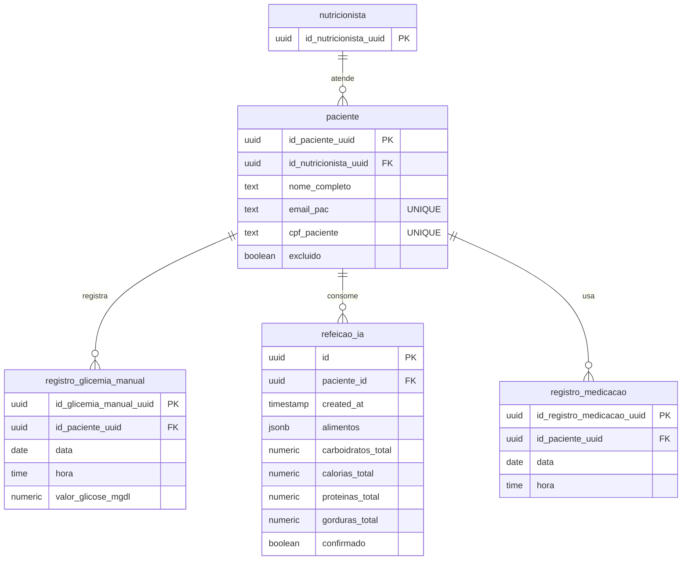

# Banco de Dados — ER + evidências (Bento)

Este documento ajuda a “fechar” o requisito **Banco de Dados** com:
- um **diagrama ER** (mermaid) para colocar no Word/slide
- uma lista de **prints** para comprovar no Supabase
- referência às **migrations** do repositório

## Onde está no repositório

- Migrations do Supabase: `GlicNutri/supabase/migrations/`
- Dataset ML (tabelas usadas no export): `public.paciente`, `public.registro_glicemia_manual`, `public.refeicao_ia`, `public.registro_medicacao`

## Diagrama ER (alto nível)

## Evidências (prints) recomendadas no Supabase

Faça prints no Supabase (Table editor / Database):

1) **Lista de tabelas** principais (pelo menos):
   - `nutricionista`
   - `paciente`
   - `registro_glicemia_manual`
   - `refeicao_ia`
   - `registro_medicacao`

2) **Chaves/constraints**:
   - `paciente.id_paciente_uuid` (PK)
   - `paciente.id_nutricionista_uuid` (FK)
   - `paciente.email_pac` (UNIQUE) e `paciente.cpf_paciente` (UNIQUE)
   - PKs das tabelas de registros (`id_*`)

3) **Exemplo de dados** (opcional):
   - 1–2 linhas em `registro_glicemia_manual` e `refeicao_ia` (sem dados sensíveis).

## Evidência no Git (sem prints)

No Word/slide, cite que a estrutura é versionada por migrations:
- `GlicNutri/supabase/migrations/`

