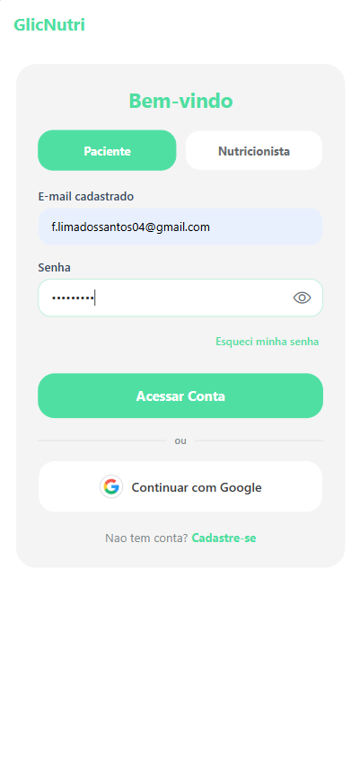
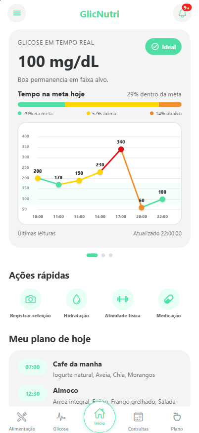
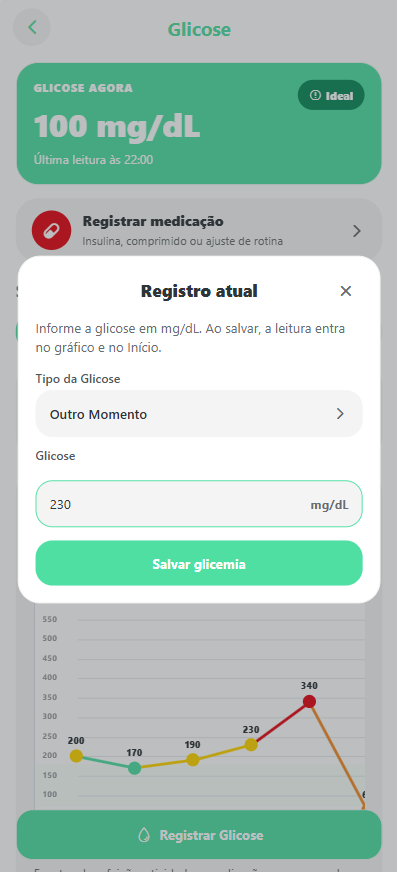
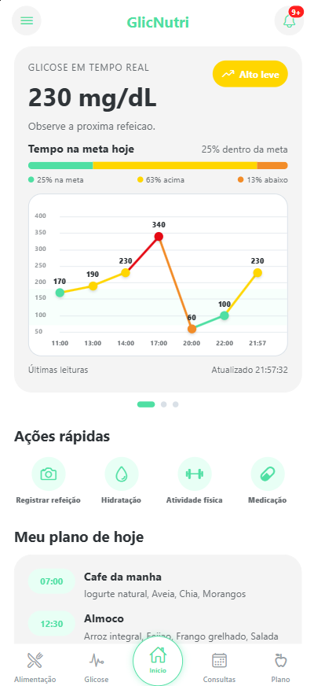
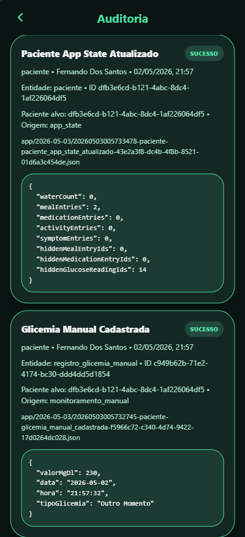
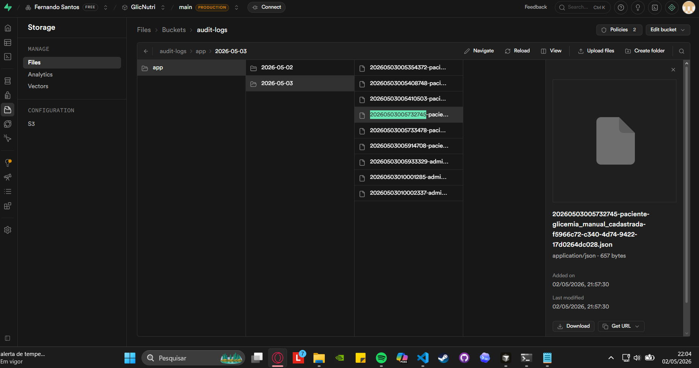
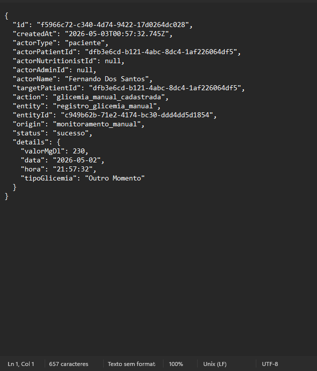

# Evidências — Auditoria via Supabase Storage

## Metadados da execução documentada

| Campo | Valor |
|-------|--------|
| Data | 02/05/2026 |
| Método | Execução real do sistema em ambiente funcional (App + Supabase), com validação de logs e interface administrativa. |
| Ambiente | App Expo/React Native integrado ao Supabase do grupo |
| Papéis de teste | Paciente, nutricionista, administrador |

---

## 1. Objetivo da evidência

Demonstrar que:

- O sistema registra eventos de auditoria
- Os logs são persistidos no Supabase Storage (`audit-logs`)
- As informações são consumidas pela interface administrativa
- O fluxo completo funciona em execução real

---

## 2. Evidências reais do sistema (execução em ambiente)

### Login



Usuário insere credenciais no sistema.



Usuário autenticado com sucesso e redirecionado ao sistema.

---

### Registro de glicemia



Usuário realiza o registro de glicemia.



Registro persistido corretamente no sistema.

---

### Auditoria no sistema



Eventos registrados e exibidos na interface administrativa.

---

### Logs no Supabase Storage



Arquivos JSON armazenados no bucket `audit-logs`.



Conteúdo do log demonstrando persistência e estrutura dos dados.

---

## 3. Origem dos logs (código)

Logs gerados por:

- `registrarLogAuditoria`
- Local: `GlicNutri/src/servicos/servicoAuditoria.js`

Formato de armazenamento:

```text
audit-logs/app/AAAA-MM-DD/<timestamp>-<actorType>-<action>-<id>.json
```

Implementação: [`GlicNutri/src/servicos/servicoAuditoria.js`](../../../src/servicos/servicoAuditoria.js).

---

## 4. Observação sobre evidências visuais

As evidências apresentadas neste documento foram obtidas a partir da execução real do sistema.

Os arquivos PNG localizados na pasta `./prints/` representam:

- Fluxo de autenticação (login)
- Registro de glicemia
- Visualização de auditoria no app
- Persistência de logs no Supabase Storage

Essas evidências substituem versões anteriores baseadas em diagramas (SVG), garantindo validação prática do sistema.

Caso os arquivos SVG sejam mantidos, eles servem apenas como referência complementar e não como evidência principal.

---

## 5. Roteiro ↔ eventos

Tabela resumida; detalhe em [`roteiro-testes.md`](roteiro-testes.md).

| Passo | Evento esperado | Código |
|-------|-----------------|--------|
| Login paciente | `login_sucesso_paciente` | `TelaLogin.js` |
| Glicemia manual | `glicemia_manual_cadastrada` | `servicoDadosPaciente.js` |
| Refeição IA | `refeicao_ia_registrada` | `servicoRefeicaoIA.js` |
| Admin consulta auditoria | listagem + `admin_consulta_auditoria` | `TelaAuditoriaAdmin.js` |

---

## 6. Exemplo de payload JSON (ilustrativo)

```json
{
  "action": "login_sucesso_paciente",
  "actorType": "paciente",
  "entity": "sessao",
  "status": "sucesso"
}
```
